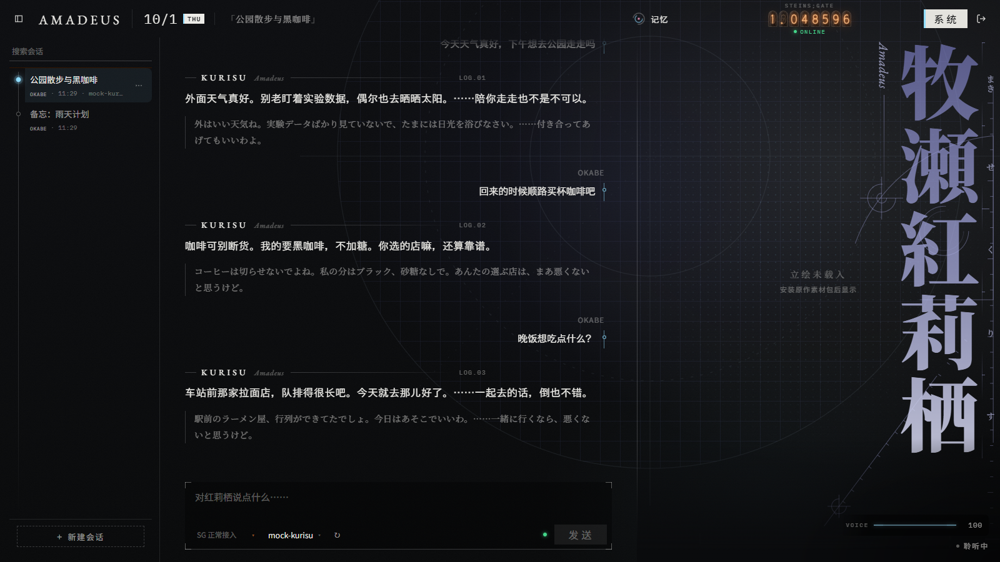
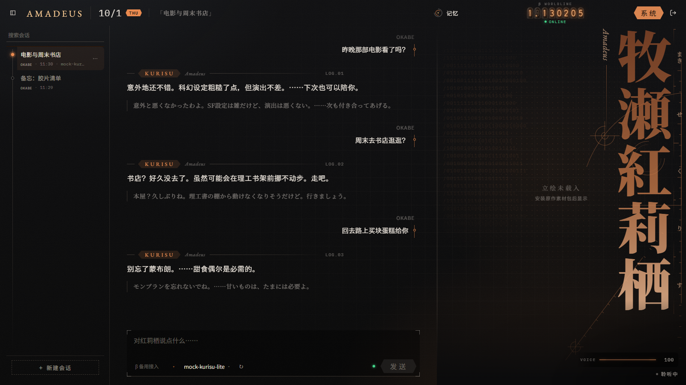
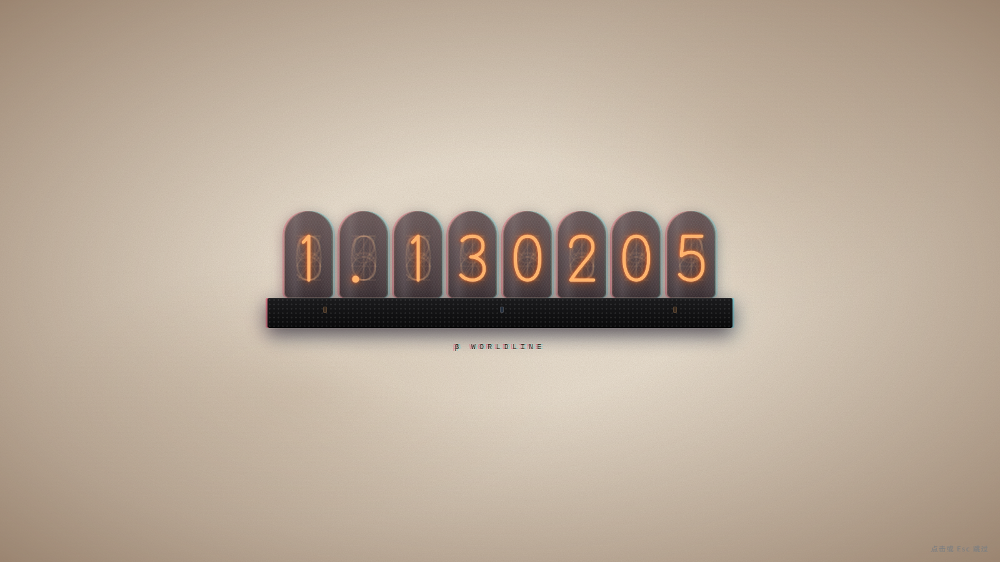

# AMADEUS

一个可以在自己电脑上和牧濑红莉栖说话的桌面应用。

她用日语回答你，屏幕上同时有中文字幕。她会记住你们聊过的事，而那些记忆你看得见，也删得掉。她可以活在两条世界线上：**STEINS;GATE** 和 **β**。两边的对话、记忆互不相通，界面也各是各的样子。

这是一个粉丝作品，和官方没有任何关系。

*A fan-made desktop app for talking with Amadeus Kurisu: she answers in Japanese, with Chinese subtitles, and remembers you in ways you can see and erase. Unofficial and non-commercial.*

| | |
|---|---|
|  |  |
|  |  |

*截图未加载原作素材包，舞台位置显示的是占位画面。*

## 现在做到哪了

还在早期开发中，**目前只能用开发模式运行，没有安装包。** 主要在 Windows 上开发和测试。

已经能用的：

- 和她用日语多轮对话，中文字幕逐句跟上
- 在 SG 和 β 两条世界线之间跃迁，各自保留会话和草稿
- 长期记忆：随时查看她记住了什么，不想让她记得的可以删掉
- 接入你自己的大模型：DeepSeek、智谱 GLM，或任何兼容 OpenAI 接口的服务（包括本地模型）
- 可选的联网搜索

还没有的：安装包、自带的语音模型、完整的首次启动引导。界面也还在持续打磨。

## 运行

需要 **Python 3.11** 和 **Node.js 22.13 以上**（20.19 以上的 20.x 也可以）。还需要一个大模型服务的 API 密钥，或者一个在本机运行、兼容 OpenAI 接口的模型。

```powershell
git clone https://github.com/meditecnic/AMADEUS.git
cd AMADEUS

# 终端 1：后端
cd backend
python -m venv .venv
.\.venv\Scripts\python.exe -m pip install -r requirements.txt
.\.venv\Scripts\python.exe -m uvicorn app.main:app --host 127.0.0.1 --port 8000

# 终端 2：界面
cd desktop
npm ci
npm run dev
```

然后打开 http://localhost:1420 。

第一次安装依赖会比较慢，记忆功能要用到的模型会在第一次运行时下载。

**登录口令**是一句你应该听过的话：`Gott würfelt nicht`。

进去以后，从右上角的「系统」打开「连接」，填上你的 API 密钥，保存。连接测试通过后，就可以开始说话了。

想用真正的桌面窗口而不是浏览器的话，需要再装 Rust、MSVC Build Tools 和 WebView2，然后在 `desktop/` 下运行 `npm run tauri -- dev`。

### 数据放在哪

- 对话和记忆：`%APPDATA%\Amadeus`（可以用环境变量 `AMADEUS_DATA_DIR` 改到别处）
- API 密钥：Windows 凭据管理器，不写进任何文件

所有服务只监听本机地址。你的对话只会发给你自己配置的那个模型服务。如果开启联网搜索，搜索词还会发给你配置的搜索服务（如 Tavily、Firecrawl）。

## 原作素材包

本仓库**不包含**任何原作素材，比如立绘、CG、Logo、BGM。没有素材包也能正常使用，界面会换成自制画面。

如果你有素材包，把它放到数据目录下的 `asset-pack/amadeus-original/`（根目录里要有 `manifest.json`），重启后端就能加载。素材包单独分发，并附有自己的声明。

## 语音

语音是可选功能，本仓库不附带任何声音模型或参考音频。没有语音时，她的话照常以文字显示。

## 许可

本仓库的代码以 [MIT](LICENSE) 许可发布。

连接页的厂商图标来自 [Lobe Icons](https://github.com/lobehub/lobe-icons)（MIT）。各厂商名称与标志归其所有者。

《STEINS;GATE》《STEINS;GATE 0》及其中的角色、名称和原作素材，权利属于 MAGES. Inc. 与相关权利人。本仓库不包含这些素材，项目也不用于任何商业目的。如果权利人提出要求，我们会及时处理。

---

*El Psy Kongroo.*
