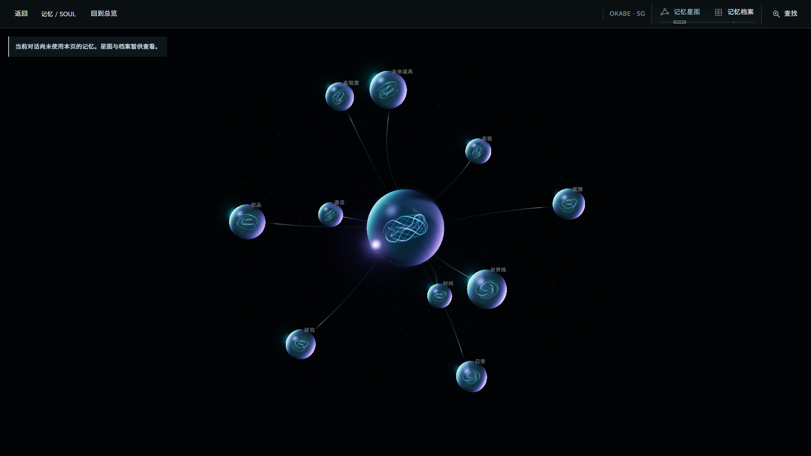

# AMADEUS

一个可以在自己电脑上和牧濑红莉栖说话的桌面应用。

她使用日语回答，屏幕上同时有中文字幕。她会记住你们聊过的事，记忆在星图中，能看得见，也删得掉。（Amadeus的人格设定基本上就是参考官方小说和相关资料）本项目共有两条世界线：**STEINS;GATE** 和 **β**。两边的对话、记忆互不相通，界面也各是各的样子。（sg线相当于是架空的，在现实中红莉栖还活着的情况下，诞生的Amadeus；加了些设定，你在sg线提到真实红莉栖，Amadeus还会争风吃醋，嘿嘿。）

这是一个粉丝作品，和官方没有任何关系。

*A fan-made desktop app for talking with Amadeus Kurisu: she answers in Japanese, with Chinese subtitles, and remembers you in ways you can see and erase. Unofficial and non-commercial.*

| | |
|---|---|
|  |  |
|  |  |

*截图未加载原作素材包，舞台位置显示的是占位画面。世界线跃迁那张是新转场动画的原型截帧，尚未接入应用；记忆星图里是测试数据。*

## 现在做到哪了

实际已经开发了大约三个月。一开始没考虑到版权问题，所以另开了这个仓库公开，这里的提交历史比实际开发时间短。

旧版界面（工作站界面重构之前）有 Windows 安装包，暂时还没放到这个仓库；**重构后的新界面目前只能用开发模式运行。** 主要在 Windows 上开发和测试。

已经能用的：

- 和她用日语多轮对话，中文字幕逐句跟上
- 用红莉栖的声音念出她的回答（需要另外跑 GPT-SoVITS，见下面「语音」）
- 在 SG 和 β 两条世界线之间跃迁，各自保留会话和草稿
- 长期记忆：随时查看她记住了什么，不想让她记得的可以删掉
- 接入你自己的大模型：DeepSeek、智谱 GLM，或任何兼容 OpenAI 接口的服务（包括本地模型）
- 可选的联网搜索

还没有的：新界面的安装包、完整的首次启动引导。界面也还在持续打磨。

## 运行

需要 **Python 3.11** 和 **Node.js 22.13 以上**（20.19 以上的 20.x 也可以）。还需要一个大模型服务的 API 密钥，或者一个在本机运行、兼容 OpenAI 接口的模型。

```powershell
git clone https://github.com/meditecnic/AMADEUS.git
cd AMADEUS

# 终端 1：后端
cd backend
python -m venv .venv
.\.venv\Scripts\python.exe -m pip install -r requirements.txt
.\.venv\Scripts\python.exe -m uvicorn app.main:app --host 127.0.0.1 --port 8000

# 终端 2：界面
cd desktop
npm ci
npm run dev
```

然后打开 http://localhost:1420 。

第一次安装依赖会比较慢，记忆功能要用到的模型会在第一次运行时下载。

**登录口令**是：`Gott würfelt nicht`。（算是原作的一个小彩蛋吧，后续我也会做些调整）

进去以后，从右上角的「系统」打开「连接」，填上你的 API 密钥，保存。连接测试通过后，就可以开始说话了。

想用真正的桌面窗口而不是浏览器的话，需要再装 Rust、MSVC Build Tools 和 WebView2，然后在 `desktop/` 下运行 `npm run tauri -- dev`。

### 数据放在哪

- 对话和记忆：`%APPDATA%\Amadeus`（可以用环境变量 `AMADEUS_DATA_DIR` 改到别处）
- API 密钥：Windows 使用凭据管理器；非 Windows 只存内存，重启后需要重新填写

所有服务只监听本机地址。你的对话只会发给你自己配置的那个模型服务。如果开启联网搜索，搜索词还会发给你配置的搜索服务（如 Tavily、Firecrawl）。

## 原作素材包

本仓库**不包含**任何原作素材，比如立绘、CG、Logo、BGM。没有素材包也能正常使用，界面会换成自制画面。

如果你有素材包，把它放到数据目录下的 `asset-pack/amadeus-original/`（根目录里要有 `manifest.json`），重启后端就能加载。素材包单独分发，并附有自己的声明。（版权问题，目前的解法就只能是素材包了）

## 语音

语音是可选功能。没有语音时，她的话照常以文字显示。

**语音合成**用的是 [GPT-SoVITS](https://github.com/RVC-Boss/GPT-SoVITS)，声音模型是 Hugging Face 上 bysq 训练的 [TTS-KurisuMakise](https://huggingface.co/bysq/TTS-KurisuMakise)（GPT-SoVITS v2pro，Apache-2.0）。本仓库不附带模型权重和参考音频，需要自己下载。（参考音频我本地是有的，但是考虑到版权的问题，总之，这些阻力，我后续开发都会尽量解决）

在本机启动 GPT-SoVITS 的 API 服务后，后端会自动连上（默认 `http://127.0.0.1:9880`，可用 `SOVITS_URL` 改）。把 `SOVITS_GPT_WEIGHTS` 和 `SOVITS_SOVITS_WEIGHTS` 设为两个权重文件的路径，后端连接时会自动加载。

**语音识别**：首次使用麦克风时，会从 [sherpa-onnx 的 GitHub 发布](https://github.com/k2-fsa/sherpa-onnx/releases/tag/asr-models)下载 SenseVoice int8 模型包（约 163 MB）和 Silero VAD（约 644 KB），保存在数据目录的 `models/speech/`。下载经固定 SHA-256 校验后才使用。SenseVoice 权重采用 FunASR Model Open Source License v1.1，Silero VAD 为 MIT；更多依赖许可见[第三方说明](THIRD_PARTY_NOTICES.md)。（其实这个前端页面还没做，哈哈）

已有本地模型时，可用 `SENSEVOICE_MODEL` 指定 ONNX 文件或模型目录，`SENSEVOICE_TOKENS` 指定词表，`AMADEUS_VAD_MODEL` 指定 Silero ONNX 文件。

## 许可

本仓库的代码以 [MIT](LICENSE) 许可发布。

连接页的厂商图标来自 [Lobe Icons](https://github.com/lobehub/lobe-icons)（MIT）。各厂商名称与标志归其所有者。

《STEINS;GATE》《STEINS;GATE 0》及其中的角色、名称和原作素材，权利属于 MAGES. Inc. 与相关权利人。本仓库不包含这些素材，项目也不用于任何商业目的。如果权利人提出要求，我们会及时处理。

## 个人的碎碎念吧

因为一直是个人开发，中途的困难挫折也有很多，目前最棘手的应该就是版权问题了，但是我尽量在1个月左右推送首个MVP安装包。（尽量不鸽）

okeydokey，大概就是这些，那么来句帅气的收尾吧：El Psy Kongroo.

---